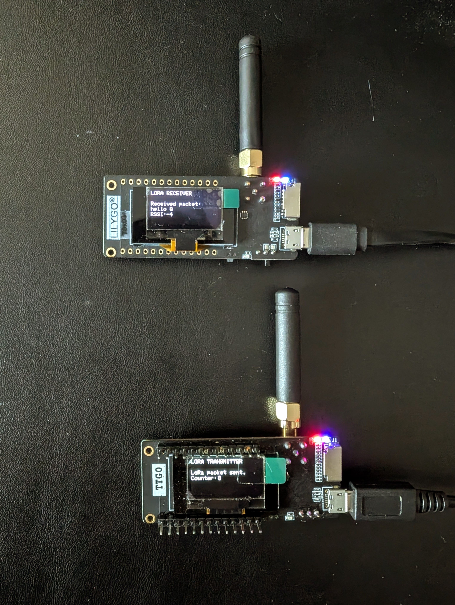

# TTGO LoRa32 - Transmisor y Receptor para **TTGO-T3_V1.6**

Este proyecto permite configurar un TTGO LoRa32 SX1276 para operar como **transmisor** o **receptor** de datos mediante LoRa.

<p align="center">
    
</p>

## 📌 Características
- Usa **PlatformIO** para la gestión del código y compilación.
- Permite alternar entre **modo TRANSMITTER** y **modo RECEIVER** sin modificar el código.
- Incluye una pantalla **OLED SSD1306** para visualizar mensajes enviados y recibidos.
- Utiliza la frecuencia **866 MHz** (puede ajustarse para otras regiones).
- Configuración sencilla mediante **`platformio.ini`**.
- Compatible con la placa **TTGO-T3_V1.6**.

---

## 🚀 Cómo usar este código
### 1️⃣ Instalación
1. **Requisitos previos:**  
   - Tener instalado **PlatformIO** en **VS Code**.
   - Disponer de una **placa TTGO LoRa32 SX1276**.

2. **Clona este repositorio o copia el código en tu proyecto PlatformIO.**

### 2️⃣ Configurar modo TRANSMITTER o RECEIVER
Para seleccionar el modo de operación, edita el archivo `platformio.ini` y cambia la variable `MODE`:

- **Modo Transmisor:**
  ```ini
  build_flags = -DMODE=TRANSMITTER
  ```
- **Modo Receptor:**
  ```ini
  build_flags = -DMODE=RECEIVER
  ```

### 3️⃣ Compilar y Subir el Código
Una vez seleccionado el modo, compila y sube el código a la placa TTGO LoRa32:

```sh
pio run --target upload
```

Para ver los mensajes en el **Monitor Serie**:
```sh
pio device monitor
```

---

## 📝 Funcionamiento del Código
### 🔹 Transmisor (`TRANSMITTER`)
- Envía un paquete cada 10 segundos con un mensaje **"hello X"**, donde `X` es un contador.
- Muestra en la pantalla OLED el número de paquetes enviados.

### 🔹 Receptor (`RECEIVER`)
- Escucha continuamente mensajes entrantes por LoRa.
- Muestra el mensaje recibido en la pantalla OLED y en el **Monitor Serie**.

---

## 📡 Conexiones TTGO LoRa32 SX1276
| Componente   | Pin TTGO LoRa32 |
|-------------|----------------|
| SCK         | 5              |
| MISO        | 19             |
| MOSI        | 27             |
| SS          | 18             |
| RST         | 14             |
| DIO0        | 26             |
| OLED SDA    | 21             |
| OLED SCL    | 22             |
| OLED RST    | 23             |

---

## 📖 Referencias
- Tutorial original: [Random Nerd Tutorials](https://RandomNerdTutorials.com/ttgo-lora32-sx1276-arduino-ide/)
- Documentación de **PlatformIO**: [platformio.org](https://platformio.org/)
